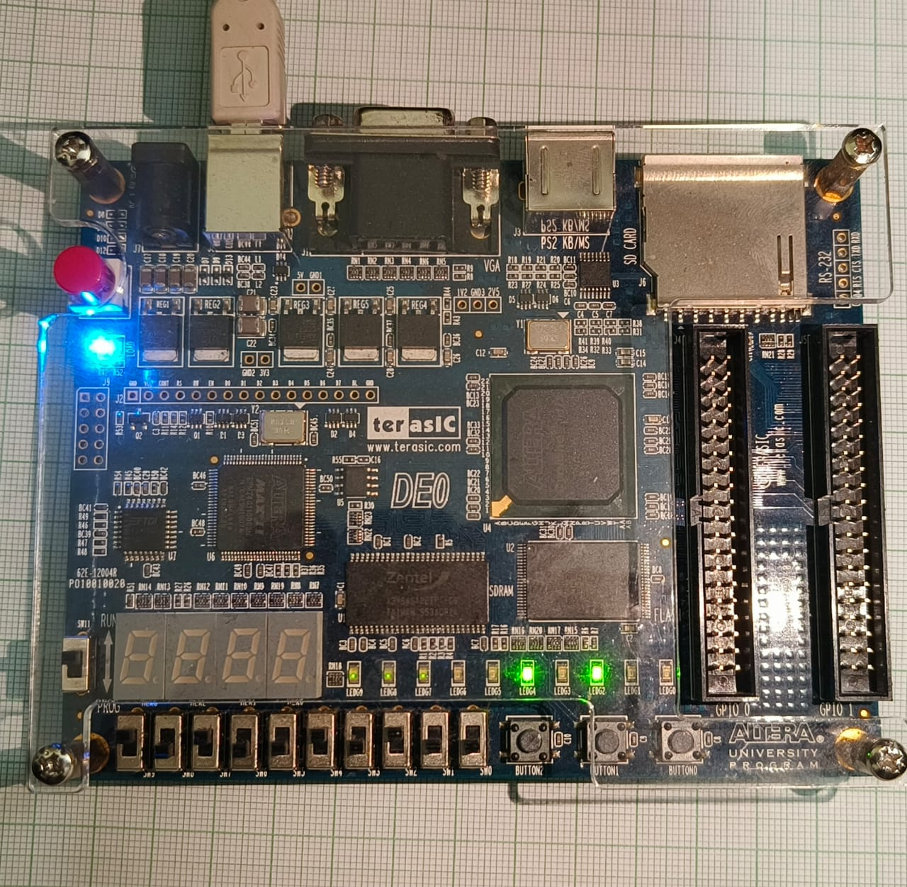

# Synchronous FIFO Memory (FPGA Implementation)

This project presents the design, simulation, and FPGA implementation of a **Synchronous First-In-First-Out (FIFO) Memory Module** with negative reset. The system is modeled using **Verilog HDL**, synthesized using **Intel Quartus II**, and implemented on the **Terasic DE0 Cyclone III FPGA board**.


## 📘 Abstract

FIFO memory is widely used in digital systems to manage data flow between two subsystems. This project focuses on **synchronous FIFO**, where both read and write operations are driven by the same clock signal, enabling reliable and efficient communication without crossing clock domains.

The FIFO architecture includes:
- Memory array (16×8)
- Binary-coded read/write pointers
- Full and Empty status flags
- Control logic for safe data access

The Verilog design is tested with a testbench, simulated in ModelSim, and successfully synthesized for hardware deployment.


## 🛠️ Features

- **M × N FIFO architecture**, where:
  - `M` = FIFO depth (must be a power of 2)
  - `N` = Data width (any natural number)
- FIFO configuration is easily customizable via two macros:
  ```verilog
  `define size 16    // Depth (M), power of 2
  `define width 8    // Width (N)
- Full/Empty Flag Detection
- Binary Pointers for simplicity
- Functional simulation and synthesis using **Quartus II Web Edition**
- Deployed on **Terasic DE0** FPGA board

## 🔗 EDA Playground
- [https://edaplayground.com/x/dhcj]

## 🔧 Tools Used
- **Verilog HDL**
- **Intel Quartus II Web Edition**
- **ModelSim / GTKWave**
- **EDA Playground** (for early prototyping)
- **Altera DE0 FPGA Board**

## 🧩 Synthesized Design

Below is the elaborated RTL schematic after synthesis in Quartus II:


## 📊 Simulation & Testing

The testbench writes eight 8-bit values into the FIFO, then reads them back, verifying `fifo_full` and `fifo_empty` status. Waveform output is dumped for analysis using `$dumpfile`, `$dumpvars`, and `$monitor`.

### 📊 Waveform


## 🔌 FPGA Deployment

### 🧪 Pin Mapping (DE0 Board)

| Signal       | Pin   | Direction | Description                  |
|--------------|--------|-----------|------------------------------|
| clk          | G21    | Input     | Clock signal                 |
| rst_n        | F2     | Input     | Active-low reset             |
| wr           | E4     | Input     | Write enable                 |
| rd           | E3     | Input     | Read enable                  |
| data_in[7:0] | F1..C1 | Input     | 8-bit parallel input         |
| data_out[7:0]| J6..D1 | Output    | 8-bit parallel output        |
| fifo_full    | F3     | Output    | FIFO full flag               |
| fifo_empty   | Auto   | Output    | FIFO empty flag              |


### 📷 Real Hardware Output
Below is the DE0 FPGA board running the FIFO design:




## 💡 Applications

- Buffering data in communication systems
- Bridging data rate mismatches
- Embedded systems requiring real-time processing
- Interfaces between processors and slower peripherals

